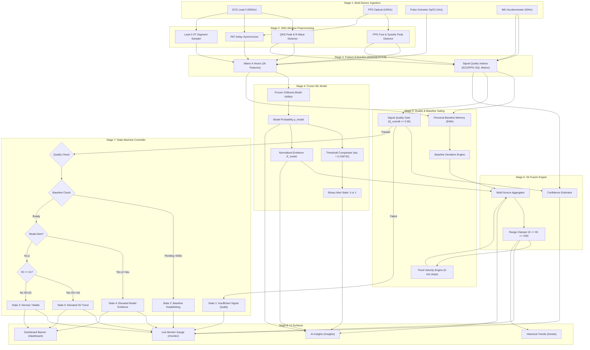

# BeatAhead ISI End-to-End Data Flow Architecture
**Document ID:** BEATAHEAD-ISI-DATA-FLOW-V1.0  
**Status:** SPECIFICATION ONLY  
**Date:** 2026-09-22  

---

## 1. High-Level Flow Pipeline

The end-to-end data pipeline routes raw continuous physiological streams into standardized features, executes inference against the frozen machine learning model, applies personal baseline and signal quality gating, calculates the composite Ischemic Stress Index (ISI), and renders contextual visualizations across user interface surfaces.

```
+-------------------------------------------------------------------------------------------------------------+
|                                        BEATAHEAD END-TO-END DATA FLOW                                       |
+-------------------------------------------------------------------------------------------------------------+

 [ 1. RAW SIGNALS ]
     |-- ECG Lead II (500 Hz)
     |-- Photoplethysmogram (PPG, 100 Hz)
     |-- Pulse Oximeter (SpO2, 1 Hz)
     +-- Accelerometer / IMU (50 Hz)
            |
            v
 [ 2. PREPROCESSING & WINDOWING ]
     |-- Bandpass Filtering & Baseline Wander Removal (0.5 - 40 Hz)
     |-- Peak Detection & Pulse Waveform Segmentation
     |-- Moving Buffer: 300s Observation Window (T_obs = 300s)
     +-- Synchrony Alignment: R-Peak to PPG Foot Pulse Arrival Time (PAT)
            |
            v
 [ 3. FEATURE EXTRACTION ]
     |-- 26 Matrix A Multimodal Features
     |   * 8 ECG Features (HR mean/std, SDNN, RMSSD, pNN50, R-amp, QRS width, ECG SQI)
     |   * 4 PAT Features (median, IQR, valid fraction, valid flag)
     |   * 4 PPG Features (pulse amp, perfusion index, crest time, PPG SQI)
     |   * 4 SpO2 Features (mean, min, std, desat count)
     |   * 6 ST Deviation Features (mean, median, min, std, baseline delta, slope)
     +-- Quality Indicators (ECG SQI, PPG SQI, PAT Valid, Motion Intensity)
            |
            +---------------------------------------+
            |                                       |
            v                                       v
 [ 4. FROZEN ML INFERENCE ]             [ 5. QUALITY & BASELINE ENGINE ]
     * Frozen XGBoost Matrix A              * Signal Quality Gating (Q_overall)
     * Models Dir: models/                  * Personal Baseline Tracker (EMA alpha=0.02)
     * Output:                              * Feature Baseline Deviations (Delta HR, Delta SDNN, Delta PAT)
       - p_model in [0, 1]                  * Short-Term Trend Velocity (5-min slope)
       - Threshold tau = 0.156742           +-- IMU Motion Gating & Lockout
       - Binary Alert State (0 or 1)                |
            |                                       |
            v                                       v
     [ 6. MODEL EVIDENCE TRANSFORM ]                |
       * Piecewise Sigmoidal Scaling                |
       * Maps tau (0.156742) -> 0.50                |
       * Yields E_model in [0, 1]                   |
            |                                       |
            +-------------------+-------------------+
                                |
                                v
 [ 7. ISI COMPOSITE FUSION ENGINE ]
     * Multi-Factor Weighted Aggregation:
       - Model Evidence: E_model * 0.45
       - Autonomic Deviation: D_auto * 0.30
       - Perfusion / Oxygenation Strain: D_perf * 0.25
       - Trend Momentum Modifier: M_trend (+/- 0.15)
     * Personal Resting Anchor: ISI_base (40)
     * Strict Mathematical Range Clamping: 0 <= ISI <= 100
     * Confidence Scoring: Confidence = Q_overall * (1 - Motion)
            |
            v
 [ 8. PRODUCT STATE MACHINE CONTROLLER ]
     * Evaluates Quality, Baseline Progress, Model Alert, and ISI Level
     * Transitions between 5 Discrete States:
       - 1. Insufficient Signal Quality
       - 2. Baseline Establishing
       - 3. Normal / Stable
       - 4. Elevated Model Evidence
       - 5. Elevated ISI Trend
            |
            v
 [ 9. USER INTERFACE RENDERING ]
     |-- Live Monitor (/monitor): Real-time Circular Gauge + 120s Rolling Trend Chart
     |-- AI Insights (/insights): Research Model Signal Card + Feature Contribution Breakdown
     |-- Trends (/trends): 24h / 7d / 30d Historical Longitudinal Progression
     |-- Dashboard (/dashboard): Executive Overview & Daily Risk Trend Banner
     +-- System Header & Badges: "RESEARCH MODEL — SIMULATED INPUT" vs "LIVE PHYSIOLOGICAL INPUT"
```

---

## 2. Detailed Pipeline Stages & Transformations



---

## 3. Data Transformations & Type Mappings

### Transformation A: Raw Waveforms $\rightarrow$ Feature Vector
- **Input**: 150,000 raw ECG samples, 30,000 PPG samples, 300 SpO2 samples, 15,000 IMU samples.
- **Output**: 1 record of 26 floating-point numbers conforming to `feature_schema.json`.
- **Validation**: Strict boundary checks (e.g., $HR \in [20, 300]$, $QRS \in [30, 300]$, $ST \in [-15, 15]$).

### Transformation B: Feature Vector $\rightarrow$ Model Evidence
- **Input**: 26 Matrix A features.
- **Engine**: Frozen XGBoost binary classifier loaded in memory.
- **Output**:
  - $p_{\text{model}} \in [0.0, 1.0]$
  - $\text{ALERT} \in \{0, 1\}$ (where $\text{ALERT} = 1 \iff p_{\text{model}} \ge 0.156742$)
  - $E_{\text{model}} \in [0.0, 1.0]$ via piecewise sigmoid:
    $$E_{\text{model}}(p) = \begin{cases} 
    0.50 \cdot (p / 0.156742)^{1.4} & p < 0.156742 \\
    0.50 + 0.50 \cdot (1 - \exp(-4.0 \cdot \frac{p - 0.156742}{1 - 0.156742})) & p \ge 0.156742
    \end{cases}$$

### Transformation C: Deviations & Evidence $\rightarrow$ ISI Product Score
- **Inputs**: $E_{\text{model}}$, $\Delta HR$, $\Delta SDNN$, $\Delta SpO2$, $\Delta PAT$, Trend Velocity, $ISI_{\text{base}} = 40$.
- **Calculation**:
  $$\text{ISI}_{\text{raw}} = 40 + [0.45(E_{\text{model}} - 0.20) + 0.30 D_{\text{auto}} + 0.25 D_{\text{perf}} + M_{\text{trend}}] \times 60.0$$
- **Output**: Bounded integer:
  $$\text{ISI} \in [0, 100]$$

### Transformation D: Product Score $\rightarrow$ UI State & Copy
- **Inputs**: $\text{ISI}$, $\text{ALERT}$, $Q_{\text{overall}}$, State.
- **Visual Mapping**:
  - `0 - 30`: `"Lower observed trend"` (Green `#10B981`)
  - `31 - 60`: `"Intermediate observed trend"` (Amber `#F59E0B`)
  - `61 - 100`: `"Higher observed trend"` (Red `#DC2626`)
- **Copy Restrictions**: Strictly non-diagnostic; observational phrasing only.

---

## 4. Latency, Buffering & Cadence Budget

| Pipeline Step | Processing Cadence | Latency Budget | Buffer Window | Fault Action |
| :--- | :--- | :--- | :--- | :--- |
| **Sensor Sampling** | Continuous ($50–500\text{ Hz}$) | $< 5\text{ ms}$ | 1-second ring buffer | Reconnect socket |
| **QRS & Beat Extraction** | Real-time per beat (~$1\text{ Hz}$) | $< 10\text{ ms}$ | 10-second beat cache | Hold last rate |
| **Matrix A Windowing** | Rolling every 1–5 seconds | $< 25\text{ ms}$ | 300-second FIFO buffer | Zero pad / drop window |
| **ML Inference (Daemon)** | On window completion | $< 15\text{ ms}$ | N/A | Trigger CLI fallback |
| **ML Inference (CLI Fallback)** | On daemon timeout | $< 450\text{ ms}$ | N/A | Return cached state |
| **Baseline Update** | Every 60 seconds (stable only) | $< 2\text{ ms}$ | 600-second initial baseline | Suppress update |
| **UI Gauge Refresh** | 1000 ms cadence | $< 16\text{ ms}$ (60 fps) | 120-second display history | Retain display state |
