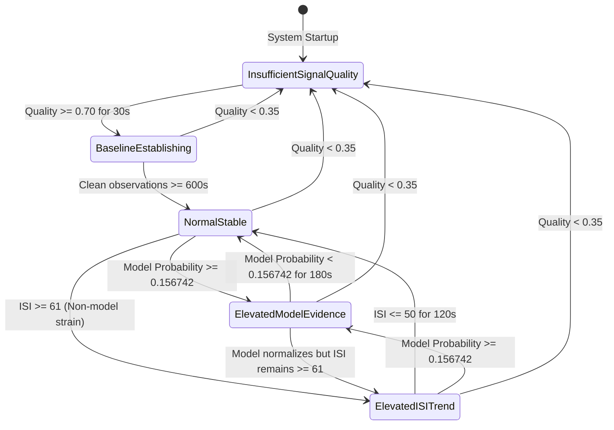

# BeatAhead Ischemic Stress Index (ISI) Formal Product Specification
**Document ID:** BEATAHEAD-ISI-SPEC-V1.0  
**Version:** 1.0.0 (Phase 8 Specification Freeze)  
**Status:** SPECIFICATION ONLY (Non-Executable / Non-Diagnostic Architecture)  
**Author:** BeatAhead Systems & Machine Learning Engineering  
**Date:** 2026-09-22  
**Target Platform:** BeatAhead Web & Staging Environment  
**Upstream Artifacts:** Frozen Phase 5/6 XGBoost Matrix A (`models/beatahead_phase5_model.joblib`), Frozen Schema v1.0.0 (`feature_schema.json`), Calibrated Decision Threshold $\tau = 0.156742$

---

## 1. Scope, Purpose & Regulatory Disclaimers

### 1.1 Purpose
This specification establishes the formal mathematical, architectural, and operational bridge between BeatAhead's user-facing **0–100 Ischemic Stress Index (ISI)** and the upstream **Frozen Phase 5/6 Machine Learning Inference Engine**. 

### 1.2 Core Architectural Principle: Model Probability is NOT ISI
> [!IMPORTANT]
> **The XGBoost model probability $p_{\text{model}}$ is strictly a conditional statistical estimate of a prospective intraoperative ST deviation event ($\ge 60$s duration at $\text{ST} \le -1.0\text{ mm}$ after a 300s buffer) trained on a surgical benchmark cohort with 0.42% natural class prevalence.**
>
> Under no circumstances must the product layer implement:
> $$\text{ISI} = p_{\text{model}} \times 100$$
> 
> Direct multiplication produces a collapsed metric where 99% of normal physiology sits between 0.0 and 1.5, and the critical decision threshold ($0.156742$) is compressed into a non-intuitive value ($15.67$). ISI is a multi-dimensional product index combining model evidence, baseline deviation, temporal trend, and signal quality.

### 1.3 Regulatory & Clinical Status
> [!CAUTION]
> **NON-DIAGNOSTIC INVESTIGATIONAL PROTOTYPE**
> 1. **No Medical Diagnostic Claims**: BeatAhead ISI is an exploratory software engineering construct designed to synthesize multi-sensor physiological trends for demonstration, usability testing, and research benchmarking.
> 2. **Not Clinically Validated**: Neither the 0–100 ISI score nor the underlying statistical model has received clearance, certification, or approval from the US FDA, European CE, or equivalent statutory bodies.
> 3. **Prohibition of Primary Triage**: ISI must never be used to diagnose myocardial ischemia, acute coronary syndromes, myocardial infarction, or to replace standard clinical 12-lead ECG, laboratory biomarkers (troponin), continuous surgical monitoring, or physician judgment.

---

## 2. Conceptual Layer Separation

To prevent conflation between statistical predictions, sensor noise, individual baseline shifts, and user display values, BeatAhead defines five strictly separated conceptual layers:

```
+-----------------------------------------------------------------------------------------------+
|                                      CONCEPTUAL ARCHITECTURE                                   |
+-----------------------------------------------------------------------------------------------+

 [ Layer A: Frozen ML Model ]
   * 26 Matrix A features extracted over 300s window (T_obs)
   * Supervised XGBoost classifier
   * Output: p_model in [0, 1], Decision Threshold tau = 0.156742
   * Discrete Model Alert State: ALERT (p >= tau) vs NORMAL (p < tau)
              |
              | (Evidence Factor)
              v
 [ Layer B: Signal Quality Assessment (SQA) ]
   * ECG SQI (clean QRS fraction), PPG SQI (perfusion / saturation), PAT validity, IMU motion
   * Overall Confidence Metric: Q in [0, 1]
   * Gating Mechanism: Inhibits false precision when signals are corrupted
              |
              | (Quality Gate & Weighting)
              v
 [ Layer C: Personal Baseline Tracking ]
   * Multi-feature personal resting baseline (HR, HRV, SpO2, PAT, ST)
   * 600s quiet initialization, EMA slow updating (alpha = 0.02) during stable states
   * Normalizes individual physiological variation without predicting disease
              |
              | (Baseline Deviation Factors)
              v
 [ Layer D: Temporal Trend & Momentum ]
   * Short-term velocity (5-min slope), medium-term trajectory (30-min window)
   * Direction: 'increasing' | 'decreasing' | 'stable'
   * Trend Persistence: Distinguishes acute transients from sustained shifts
              |
              | (Trend Momentum Modifier)
              v
 [ Layer E: ISI Product Score (0–100) ]
   * Bounded continuous index: 0 <= ISI <= 100
   * Multi-source weighted aggregation: Model Evidence (40%) + Baseline Drift (30%) + Trend (15%) + Perfusion (15%)
   * Displayed on UI Gauge with calibrated contextual risk labels
+-----------------------------------------------------------------------------------------------+
```

---

## 3. Comprehensive ISI Input Specification

The following formal table defines every input admitted into the BeatAhead ISI scoring pipeline. No unlisted or untracked physiological inputs may be introduced.

| Input Symbol | Full Name | Source | Raw Units | Normalization Range | Positive Direction | Missing Data Behavior | Quality Dependency |
| :--- | :--- | :--- | :--- | :--- | :--- | :--- | :--- |
| $p_{\text{model}}$ | Model Probability | Frozen XGBoost Matrix A | Ratio $[0, 1]$ | Piecewise Sigmoidal (Eq. 1) | Higher $\rightarrow$ Higher ISI | Return last valid up to 120s, then fallback to heuristic mode | Strictly gated if $\text{ECG\_SQI} < 0.50$ |
| $\text{ALERT}$ | Model Alert State | Threshold Comparator | Binary $\{0, 1\}$ | $\{0, 1\}$ at $\tau = 0.156742$ | $1 \rightarrow$ Elevates ISI Floor | Return 0 if model unavailable | Inherits $p_{\text{model}}$ dependency |
| $\Delta HR_{\text{base}}$ | Heart Rate Baseline Deviation | ECG Lead II | bpm | $\frac{HR - HR_{\text{base}}}{HR_{\text{base}}} \times 100$ | Higher $\rightarrow$ Higher ISI | Zero deviation assumed ($\Delta = 0$) | Clamped if $\text{ECG\_SQI} < 0.60$ |
| $\Delta SDNN_{\text{base}}$ | HRV SDNN Baseline Deviation | ECG Lead II | ms | $\frac{SDNN - SDNN_{\text{base}}}{SDNN_{\text{base}}} \times 100$ | Lower SDNN $\rightarrow$ Higher ISI | Zero deviation assumed | Suppressed if ectopic beats $> 15\%$ |
| $\Delta PAT_{\text{base}}$ | PAT Median Baseline Deviation | ECG + PPG Synchrony | ms | $\frac{PAT - PAT_{\text{base}}}{PAT_{\text{base}}} \times 100$ | Shorter PAT $\rightarrow$ Higher ISI | Excluded from factor pool | Omitted if $\text{PAT\_VALID} = 0$ |
| $\Delta SpO2_{\text{base}}$ | Oxygen Saturation Deviation | Pulse Oximeter | % | $\min(0, SpO2 - SpO2_{\text{base}})$ | Lower SpO2 $\rightarrow$ Higher ISI | Zero deviation assumed | Clamped if $\text{PPG\_SQI} < 0.60$ |
| $\Delta ST_{\text{obs}}$ | Pre-event ST Shift | ECG Lead II | mm | $ST_{\text{median}} - ST_{\text{baseline}}$ | Depressed ST $\rightarrow$ Higher ISI | Fallback to non-ST heuristic | Gated if Lead II disconnected |
| $Q_{\text{ecg}}$ | ECG Signal Quality Index | QRS Morphological Filter | Ratio $[0, 1]$ | Linear $[0, 1]$ | Higher $\rightarrow$ Higher Confidence | Defaults to 0.0 (Unusable) | Primary quality sensor |
| $Q_{\text{ppg}}$ | PPG Signal Quality Index | Pulse Waveform Analyzer | Ratio $[0, 1]$ | Linear $[0, 1]$ | Higher $\rightarrow$ Higher Confidence | Defaults to 0.0 (Unusable) | Primary quality sensor |
| $V_{\text{pat}}$ | PAT Beat Validity Flag | Beat Matching Engine | Binary $\{0, 1\}$ | $\{0, 1\}$ ($\ge 30\%$ beats in 100–450ms) | $1 \rightarrow$ Valid transit | Defaults to 0 (Invalid) | Synchrony dependency |
| $I_{\text{motion}}$ | IMU Motion Intensity | Accelerometer Vector Magnitude | a.u. / g | Clamped $[0, 1]$ | Higher $\rightarrow$ Lower Confidence | Defaults to 0.0 | Inertial sensor |
| $T_{\text{velocity}}$ | 5-Minute Trend Velocity | Moving Regression on ISI | points/min | Bounded $[-5, +5]$ | Positive $\rightarrow$ Rising Trend | Set to 0.0 during initial 5 min | Requires $\ge 5$ clean score ticks |

---

## 4. Personal Baseline Architecture

### 4.1 Initialization Period
- **Observation Window**: The personal baseline initialization requires a minimum of **600 seconds (10 minutes)** of continuous monitoring.
- **Minimum Data Validity**: At least **80% of observation windows** during initialization must satisfy $Q_{\text{overall}} \ge 0.70$.
- **State Flag**: During this period, the system operates in `Baseline Establishing` mode. The UI surfaces baseline acquisition progress ($0–100\%$) rather than a definitive deviation index.

### 4.2 Feature-Specific Baseline Parameters
Baselines are maintained independently for each physiological metric:
1. $HR_{\text{base}}$: Median resting heart rate over clean initialization (default seed: 68.0 bpm).
2. $SDNN_{\text{base}}$: Median normal-to-normal RR standard deviation (default seed: 50.0 ms).
3. $PAT_{\text{base}}$: Median pulse arrival time (default seed: 225.0 ms).
4. $SpO2_{\text{base}}$: 90th percentile resting oxygen saturation (default seed: 98.0%).
5. $ST_{\text{base}}$: Mean Lead II ST level over initial quiet surgical phase (default seed: 0.00 mm).
6. $ISI_{\text{base}}$: Nominal personal resting index target (calibrated to $40.0$).

### 4.3 Adaptive Rolling-Window Update Rules
Baselines adapt to circadian, postural, and metabolic shifts via an Exponential Moving Average (EMA):
$$B_{t} = (1 - \alpha) B_{t-1} + \alpha X_{t}$$

**Strict Update Constraints:**
- **Update Rate**: $\alpha = 0.02$ (corresponds to a slow ~50-observation smoothing horizon).
- **Conditional Gating (Crucial Anti-Drift Rule)**:
  $$\text{Update Permitted} \iff \left( \text{State} == \text{"Normal / Stable"} \right) \land \left( Q_{\text{overall}} \ge 0.75 \right) \land \left( I_{\text{motion}} < 0.30 \right)$$
  **Under no circumstances is the baseline allowed to update during `Elevated Model Evidence` or `Elevated ISI Trend`.** Updating during stress events would normalize pathological physiological deviations.
- **Outlier Rejection**: Individual observations exceeding $\pm 3.0 \times \text{IQR}$ from the current baseline are discarded as transient artifacts.

### 4.4 Non-Predictive Baseline Disclaimer
> [!NOTE]
> The personal baseline architecture establishes a patient-specific coordinate system to quantify physiological disturbance. The personal baseline does **not** predict ischemia, does not quantify coronary reserve, and does not constitute a diagnostic threshold.

---

## 5. Mathematical Prototype Specification of the ISI

### 5.1 Component 1: Normalized Model Evidence ($E_{\text{model}}$)
To map the frozen XGBoost probability $p_{\text{model}} \in [0, 1]$ with decision threshold $\tau = 0.156742$ onto a calibrated $[0, 1]$ evidence scale:

$$E_{\text{model}}(p) = \begin{cases} 
0.50 \times \left( \frac{p}{\tau} \right)^{\gamma_1} & \text{if } p < \tau \\
0.50 + 0.50 \times \left( 1 - \exp\left( -\gamma_2 \frac{p - \tau}{1 - \tau} \right) \right) & \text{if } p \ge \tau
\end{cases}$$

Where:
- $\tau = 0.156742$ (Frozen Phase 5 decision threshold).
- $\gamma_1 = 1.4$ (Sub-threshold dampening exponent: suppresses low surgical baseline noise).
- $\gamma_2 = 4.0$ (Post-threshold sensitivity factor: rapidly scales evidence when $p > \tau$).

**Boundary Behavior:**
- When $p = 0.000 \rightarrow E_{\text{model}} = 0.00$.
- When $p = 0.005$ (natural cohort median) $\rightarrow E_{\text{model}} \approx 0.008$ (negligible).
- When $p = \tau = 0.156742$ (exact decision threshold) $\rightarrow E_{\text{model}} = 0.500$ (exact midpoint).
- When $p = 0.300 \rightarrow E_{\text{model}} \approx 0.77$.
- When $p = 0.600 \rightarrow E_{\text{model}} \approx 0.96$.

### 5.2 Component 2: Autonomic & Hemodynamic Shift Factor ($D_{\text{auto}}$)
Combines heart rate elevation and heart rate variability (autonomic tone) collapse:

$$f_{\text{hr}} = \text{clamp}\left( \frac{HR - HR_{\text{base}}}{25.0}, 0.0, 1.0 \right)$$
$$f_{\text{hrv}} = \text{clamp}\left( \frac{SDNN_{\text{base}} - SDNN}{0.60 \times SDNN_{\text{base}}}, 0.0, 1.0 \right)$$

$$D_{\text{auto}} = 0.50 \cdot f_{\text{hr}} + 0.50 \cdot f_{\text{hrv}}$$

### 5.3 Component 3: Oxygenation & Vascular Perfusion Factor ($D_{\text{perf}}$)
Synthesizes pulse transit acceleration and peripheral desaturation:

$$f_{\text{spo2}} = \text{clamp}\left( \frac{SpO2_{\text{base}} - SpO2}{5.0}, 0.0, 1.0 \right)$$

If $\text{PAT\_VALID} == 1$:
$$f_{\text{pat}} = \text{clamp}\left( \frac{PAT_{\text{base}} - PAT}{50.0}, 0.0, 1.0 \right)$$
$$D_{\text{perf}} = 0.60 \cdot f_{\text{spo2}} + 0.40 \cdot f_{\text{pat}}$$
Else (PAT degraded):
$$D_{\text{perf}} = f_{\text{spo2}}$$

### 5.4 Component 4: Temporal Trend Momentum ($M_{\text{trend}}$)
Evaluates short-term rate of change over the preceding 5 minutes ($\Delta t = 300\text{ s}$):

$$v = \frac{\Delta \text{ISI}_{\text{recent}}}{\Delta t} \quad (\text{points / minute})$$
$$M_{\text{trend}} = \text{clamp}\left( \frac{v}{2.0}, -0.15, +0.15 \right)$$

### 5.5 Multi-Source Synthesis & Bounded Aggregation
The unclipped composite score is computed via linear combination:

$$\text{ISI}_{\text{raw}} = \text{ISI}_{\text{base}} + \left[ w_{\text{model}} \cdot (E_{\text{model}} - 0.20) + w_{\text{auto}} \cdot D_{\text{auto}} + w_{\text{perf}} \cdot D_{\text{perf}} + M_{\text{trend}} \right] \times 60.0$$

Where normalized weights satisfy:
- $w_{\text{model}} = 0.45$ (Dominant evidence source)
- $w_{\text{auto}} = 0.30$ (Autonomic tone support)
- $w_{\text{perf}} = 0.25$ (Oxygenation/perfusion support)
- $\sum w_i = 1.00$

### 5.6 Final Bounding & Clipping
The final product score is strictly bounded:

$$\text{ISI} = \text{round}\left( \max\left( 0.0, \min\left( 100.0, \text{ISI}_{\text{raw}} \right) \right) \right)$$

**Guaranteed Range Invariance:**
$$\forall \text{ valid inputs}, \quad 0 \le \text{ISI} \le 100$$

---

## 6. Model Alert State vs. ISI Display Score

To avoid conflating statistical model predictions with the product display index:

| Dimension | Model Alert State ($\text{ALERT}$) | ISI Display Score ($\text{ISI}$) |
| :--- | :--- | :--- |
| **Mathematical Nature** | Binary Classification ($\{0, 1\}$) | Continuous Product Index ($[0, 100]$) |
| **Origin** | Supervised XGBoost on 26 Matrix A features | Multi-source weighted heuristic fusion |
| **Threshold** | Frozen Calibrated Value: **$0.156742$** | Display ranges: Low ($\le 30$), Mid ($31–60$), High ($\ge 61$) |
| **Target Meaning** | Predicts intraoperative ST depression event $\ge 60$s in $T_{\text{target}}$ | Summarizes immediate multi-modal physiological strain |
| **Clinical Meaning** | Statistical classifier flag on surgical cohort | Illustrative UX index for trends and awareness |
| **User Presentation** | Dedicated Technical Card (`AI Insights`) | Prominent Ring Gauge (`Live Monitor` & `Dashboard`) |

---

## 7. Signal Quality & Degraded Data Behavior

The ISI calculation must never fabricate false precision from corrupted sensor streams. Overall Signal Quality ($Q_{\text{overall}}$) is defined by:

$$Q_{\text{overall}} = Q_{\text{ecg}} \times 0.40 + Q_{\text{ppg}} \times 0.35 + V_{\text{pat}} \times 0.15 + (1 - I_{\text{motion}}) \times 0.10$$

### Degradation Rules:

| Fault Condition | Operational Action | ISI Display Behavior | Confidence Metric |
| :--- | :--- | :--- | :--- |
| **$Q_{\text{ecg}} < 0.50$** (Poor ECG) | Suppress Model Inference; Freeze ST & HRV factors | Retain last valid ISI for up to 60s, then display `"Signal Degraded"` | Drops to $< 40\%$ |
| **$Q_{\text{ppg}} < 0.50$** (Poor PPG) | Suppress PPG morphology & PAT calculations | ISI computed strictly from ECG & SpO2; $w_{\text{perf}}$ zeroed | Drops to $50–65\%$ |
| **$V_{\text{pat}} == 0$** (PAT Invalid) | Graceful exclusion of PAT term | $D_{\text{perf}}$ defaults to pure SpO2 | Minimal impact (~5% confidence reduction) |
| **Missing SpO2 Sensor** | Fallback to resting $SpO2_{\text{base}}$ | Alert banner: `"Pulse oximeter disconnected"` | Confidence penalized by 20% |
| **$I_{\text{motion}} > 0.70$** (High Motion) | Lock score buffer; suppress updates | UI displays motion artifact warning badge | Confidence clamped to $\le 30\%$ |
| **$Q_{\text{overall}} < 0.35$** | Total pipeline gating | System transitions to `Insufficient Signal Quality` | UI displays dashes (`--`) |

---

## 8. Product Output State Machine

The product layer must operate under a formal 5-state discrete automaton. Transitions occur strictly based on signal quality, baseline readiness, and validated model output:



### State Definitions:
1. **`Insufficient Signal Quality`**:
   - Condition: $Q_{\text{overall}} < 0.35$ or primary lead detachment.
   - UI: Gauge displays `--`, color slate-gray, warning badge: `"Sensor contact lost or high motion artifact"`.
2. **`Baseline Establishing`**:
   - Condition: Clean data acquired for $< 600\text{ s}$.
   - UI: Circular progress indicator showing percentage of baseline established. No diagnostic numbers shown.
3. **`Normal / Stable`**:
   - Condition: $Q_{\text{overall}} \ge 0.50$, $p_{\text{model}} < 0.156742$, and $\text{ISI} \le 60$.
   - UI: Emerald gauge (or amber if $31–60$), label: `"Lower/Intermediate observed trend"`.
4. **`Elevated Model Evidence`**:
   - Condition: $p_{\text{model}} \ge 0.156742$ (Model threshold breached).
   - UI: Distinct amber/rose alert styling, explicit callout: `"Early-warning model evidence elevated"`.
5. **`Elevated ISI Trend`**:
   - Condition: $\text{ISI} \ge 61$ driven by autonomic/perfusion drift even if model probability is sub-threshold.
   - UI: Rose gauge, label: `"Higher observed trend"`, recommendation to rest and verify sensor fit.

> [!WARNING]
> **Prohibited Diagnostic Terminology:**  
> Under NO circumstances may the UI or AI agents generate statements such as:  
> - ❌ `"Heart attack detected"`  
> - ❌ `"Ischemia confirmed"`  
> - ❌ `"Coronary artery blocked"`  
> - ❌ `"Cardiac damage occurring"`  
> 
> All copy must strictly use trend-based and observational language (e.g., *"Observed physiological trend has moved above personal baseline"*).

---

## 9. AI Insights Explainability Boundaries

The `AI Insights` module is permitted to provide transparent explanations of underlying factors while strictly adhering to non-diagnostic safety guardrails:

### Permitted Explanations:
1. **Model Evidence**: State whether the frozen machine learning model detected physiological patterns resembling the surgical benchmark early-warning signatures.
2. **Personal Baseline Deviation**: Quantify percentage changes relative to the user's personal baseline (e.g., *"Heart rate is 18% above your established resting baseline"*).
3. **Contributing Physiological Metrics**: Display relative contribution breakdown across HRV, Pulse Arrival Time, Oxygenation, and ST shifts.
4. **Signal Quality & Noise**: Report whether sensor contact or motion is reducing the reliability of current readings.
5. **Temporal Course**: Describe historical trajectory (e.g., *"Metric has trended upward over the last 20 minutes"*).

### Strictly Forbidden Claims:
1. 🚫 Claiming clinical certainty or diagnosing pathology.
2. 🚫 Recommending medication adjustments or changes to prescribed therapies.
3. 🚫 Advising the user to ignore acute physical symptoms (chest pain, shortness of breath, radiating arm pain) because the ISI is low.
4. 🚫 Guaranteeing that a low ISI confirms cardiac health or rules out ischemia.

---

## 10. Summary of Architectural Guarantees

1. **Zero Model Tampering**: The frozen XGBoost model (`models/beatahead_phase5_model.joblib`) and decision threshold ($0.156742$) remain strictly immutable.
2. **Mathematically Bounded**: The ISI is guaranteed to remain within $[0, 100]$ across all possible physiological inputs.
3. **No False Precision**: Poor signal quality immediately gates calculations and suppresses spurious alerts.
4. **Decoupled Semantics**: Model classification probability ($p_{\text{model}}$) is formally separated from the product score ($\text{ISI}$).
5. **Audit Trail**: Every parameter, threshold, and equation is explicitly documented and reproducible.
